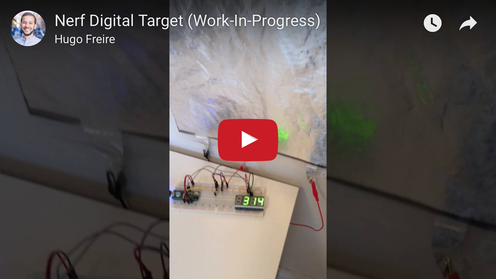
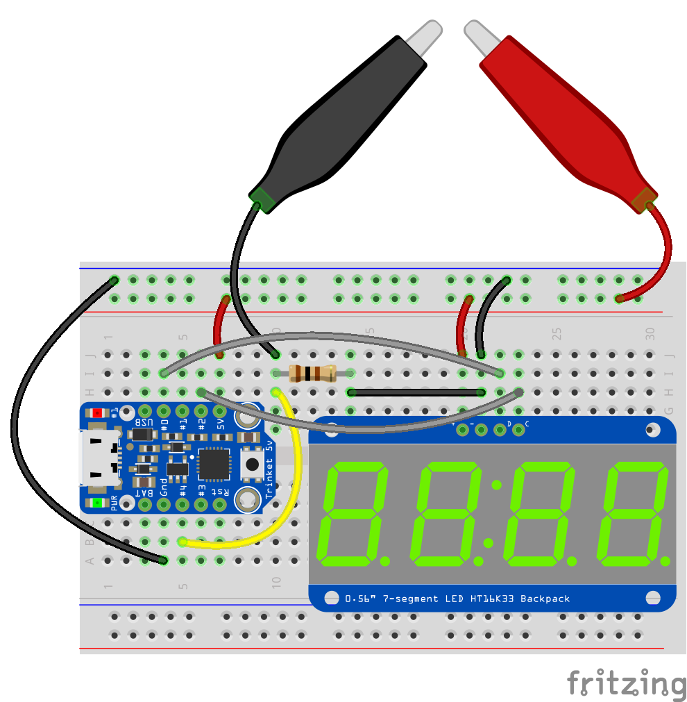

# A digital :pager: target :dart: for Nerf gun :gun: darts

Uses an [Adafruit Trinket](https://www.adafruit.com/product/1501) with a [Velostat](https://en.wikipedia.org/wiki/Velostat) pressure sensor circuit to show dart hits on a [4-Digit 7-Segment Display](https://www.adafruit.com/product/880).

  

### Features
* Detect, :muscle: measure and display :dart: dart hit impacts on the target :white_check_mark:

### How to build

  

